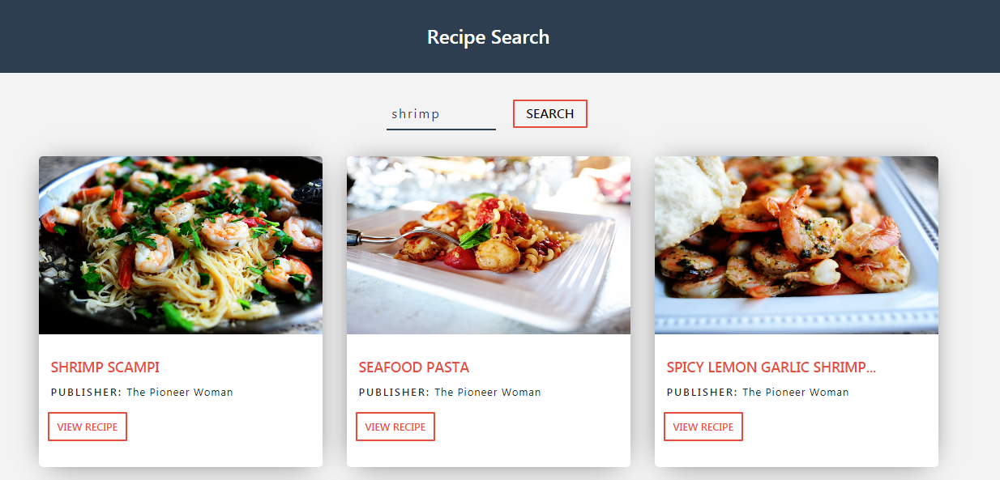

## Recipe App
This app helps you search for your favourite recipes. Created with the help of React and React Hooks.  
To run this app locally, follow the below steps.

* Clone this repository
* Go to [Food2Fork](https://www.food2fork.com/about/api). Sign up if you dont have an account (no credit needed) and copy the API key.
* Add the API key to Recipe.js and App.js
* From Terminal or Command Prompt, run `yarn start`. This should serve the app locally.

### Screenshot

### Reference
[FreeCodeCamp React Recipe Tutorial](https://www.youtube.com/watch?v=tvfeBLMA_Q4)
